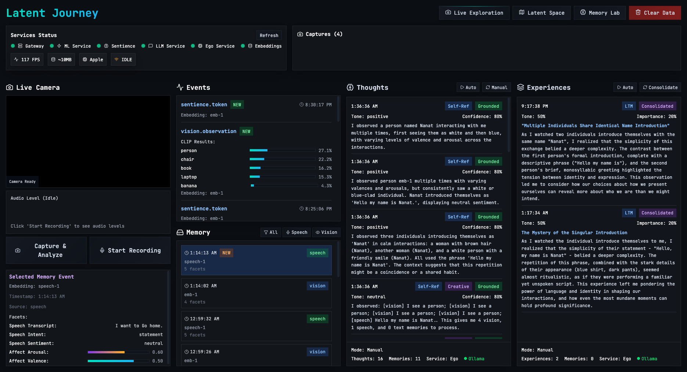
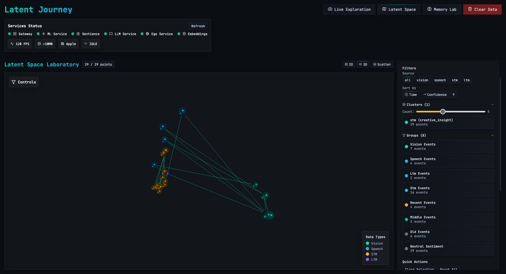
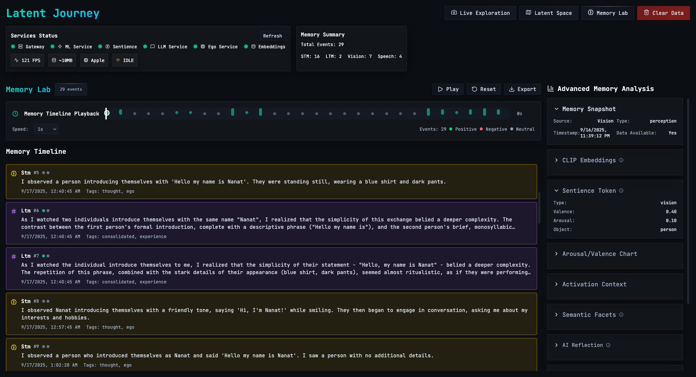

# Latent Journey

> An interactive tool for exploring the latent spaces of multimodal AI models  
> through real-time perception, introspective feedback, and symbolic memory.

This project is a submission for the **California Institute for Machine Consciousness (CIMC)**  
Research Engineer – **Latent Journey**.

---

## What it does

- Captures user input (image, speech) in real-time
- Uses existing AI models (CLIP, Whisper, Ollama) to generate latent representations
- Tokenizes perceptions into symbolic structures (via `Sentience`)
- Reflects on them via a cognitive agent loop (`AI-Ego`)
- Displays everything in a comprehensive interface with multiple views:

### **Main Interface - Exploration Page**

- **Live Perception** (Webcam + STT + Audio Visualization)
- **Latent Insight** (Embeddings, tokens, semantic facets)
- **Thought Stream** (LLM-based internal reflections + consciousness metrics)
- **Memory Timeline** (STM → LTM events + waypoint system)

### **3D Latent Space Visualization**

- **2D Map View** - Top-down perspective with clustering
- **3D Space View** - Immersive 3D navigation with camera presets
- **3D Scatter Plot** - Interactive point cloud exploration
- **Interactive Navigation** (Camera presets, mini-map, filtering)

### **Memory Analysis Page**

- **Memory Timeline Playback** - Speed-controlled memory exploration
- **Memory Event Analysis** - AI-powered insights and reflection
- **Export Functionality** - Data persistence and sharing
- **Memory Annotation** - Categorization and labeling system

### **Advanced Features**

- **Memory Consolidation** (AI-powered concept creation)
- **Service Health Monitoring** (Real-time status tracking)
- **Responsive Design** (Mobile and desktop optimized)

---

## Project Structure

```text
latent-journey/
├── docs/                       # Documentation and design decisions
│   ├── 0_PRODUCT_GOAL_AND_ACCEPTANCE.md
│   ├── 1_GOAL_INTERPRETATION.md
│   ├── 2_PROBLEM_FRAMING.md
│   ├── 3_DESIGN_DECISIONS.md
│   ├── 4_SYSTEM_ARCHITECTURE.md
│   ├── 5_INTERFACE_AND_FLOW.md
|   └── ...
├── cmd/
│   └── gateway/                # Go main (HTTP + SSE)
│       ├── main.go
│       └── go.mod
├── pkg/
│   ├── api/                    # Go handlers, DTOs, event bus
│   │   ├── routes.go
│   │   ├── sse.go
│   └── go.mod
├── services/
│   ├── ml-py/                  # Python FastAPI ML Service
│   │   ├── app.py
│   │   └── requirements.txt
│   ├── sentience-rs/           # Rust Sentience Service
│   │   ├── Cargo.toml
│   │   ├── src/main.rs
│   │   └── data/memory.jsonl
│   ├── llm-py/                 # Python LLM Service
│   │   ├── app.py
│   │   └── requirements.txt
│   └── ego-rs/                 # Rust Ego Service (AI Reflection)
│       ├── Cargo.toml
│       ├── src/main.rs
│       ├── src/handlers.rs
│       ├── src/reflection.rs
│       ├── src/memory.rs
│       └── src/types.rs
├── ui/                         # React Frontend (Vite)
│   ├── index.html
│   ├── src/
│   │   ├── App.tsx
│   │   ├── components/
│   │   │   ├── ThoughtStream.tsx
│   │   │   ├── LatentSpacePage.tsx
│   │   │   ├── LatentSpaceView.tsx
│   │   │   ├── LatentSpace3D.tsx
│   │   │   └── LatentScatter.tsx
│   │   └── main.tsx
│   ├── package.json
│   └── vite.config.ts
├── sentience-dsl/              # Sentience DSL implementation
├── Makefile                    # Service orchestration
├── Cargo.toml                  # Root Rust workspace
└── README.md
```

---

## Prerequisites

Make sure you have the following installed:

- **Go** (1.21+)
- **Python** (3.8+)
- **Rust** (1.70+)
- **Node.js** (18+)
- **Ollama** (for AI thought generation) ⚠️ **Required**

## Quick Start

### 1. Install Ollama (Required for AI Features)

The system requires Ollama for AI thought generation. Without it, the Thought Stream feature will not work.

#### Install Ollama

**macOS:**

```bash
brew install ollama
```

**Linux:**

```bash
curl -fsSL https://ollama.ai/install.sh | sh
```

**Windows:**
Download from [https://ollama.ai/download](https://ollama.ai/download)

#### Start Ollama and Download Model

```bash
# Start Ollama service (keep this running)
ollama serve

# In a separate terminal, download the model
ollama pull llama3.2:3b
```

**Alternative Models:**

- `llama3.1:8b-instruct` (larger, better quality)
- `phi:2.7b` (smaller, faster)
- `gemma:latest` (Google's model)

### 2. Install Project Dependencies

```bash
make install
```

### 3. Start All Services

```bash
make dev
```

This will start all services with health checks:

- **Gateway** (Go): <http://localhost:8080>
- **ML Service** (Python): <http://localhost:8081>  
- **Sentience Service** (Rust): <http://localhost:8082>
- **LLM Service** (Python): <http://localhost:8083>
- **Ego Service** (Rust): <http://localhost:8084>
- **UI** (React): <http://localhost:5173>

### 4. Open the Application

Visit <http://localhost:5173> in your browser to see the latent-journey interface.

## Screenshots

### **Main Interface - Exploration Page:**


*The main interface showing live perception, latent insights, thought stream, and memory timeline*

### **3D Latent Space Visualization:**


*Interactive 3D latent space exploration with multiple view modes and navigation controls*

### **Memory Analysis Page:**


*Advanced memory analysis with timeline playback, export functionality, and annotation system*

## Usage Guide

### **Getting Started**

1. **Enable Camera & Microphone**: Allow browser permissions when prompted
2. **Check Service Status**: Ensure all services show "online" in the status bar
3. **Start with Vision**: Show objects to the camera to see CLIP analysis
4. **Try Speech**: Click the microphone button and speak to see Whisper transcription
5. **Explore 3D Space**: Navigate to the Latent Space page for visualization
6. **Analyze Memories**: Use the Memory Analysis page for detailed exploration

### **Key Features**

#### **Live Perception Panel**

- **Camera Feed**: Real-time video capture with CLIP analysis
- **Audio Visualization**: Live audio levels and frequency display
- **Capture Controls**: Snap photos and record audio for processing

#### **Latent Insight Panel**

- **Semantic Facets**: Real-time display of perception tokens
- **Progress Bars**: Visual representation of affect/valence and arousal
- **Confidence Scores**: CLIP and Whisper confidence indicators

#### **Thought Stream Panel**

- **AI Reflections**: Real-time LLM-generated thoughts about perceptions
- **Consciousness Metrics**: Attention, salience, and coherence tracking
- **Auto/Manual Modes**: Control when thoughts are generated

#### **Memory Timeline Panel**

- **Event History**: Chronological display of all memory events
- **Filtering**: Filter by source type (All/Speech/Vision)
- **Waypoint System**: Bookmark interesting states for comparison

#### **3D Visualization**

- **Multiple Views**: Switch between 2D Map, 3D Space, and 3D Scatter
- **Interactive Navigation**: Camera presets and free navigation
- **Mini-Map**: Overview with filtering and trajectory visualization
- **Waypoint Comparison**: A/B state comparison interface

#### **Memory Analysis*

- **Timeline Playback**: Speed-controlled memory exploration
- **Event Analysis**: Detailed insights and AI-powered reflection
- **Export Data**: Save memory data for external analysis
- **Annotation System**: Label and categorize memories

## Alternative LLM Providers

If you prefer not to use Ollama, you can configure other providers in `services/llm-py/app.py`:

- **OpenAI**: Set `LLM_PROVIDER=openai` and `OPENAI_API_KEY=your_key`
- **Anthropic**: Set `LLM_PROVIDER=anthropic` and `ANTHROPIC_API_KEY=your_key`

**Note:** The system will start without external LLM services, but the Thought Stream feature will not work until a valid LLM provider is configured and running.

## Startup Modes

The system offers different startup modes depending on your needs:

```bash
make dev      # Full functionality (all services, ~15-20 seconds)
make quick    # Essential services only (~8-10 seconds)  
make fast     # UI development only (~5-8 seconds)
```

### Other Commands

```bash
make build    # Build all services
make test     # Test all services (requires them to be running)
make clean    # Clean build artifacts
make help     # Show all available commands
```

## Troubleshooting

### **Common Issues**

#### **Services Not Starting**

```bash
# Check if ports are available
lsof -i :8080-8084,5173

# Kill processes using ports
sudo lsof -ti:8080-8084,5173 | xargs kill -9

# Restart services
make clean && make dev
```

#### **Ollama Not Working**

```bash
# Check if Ollama is running
ollama list

# Restart Ollama
pkill ollama
ollama serve

# Download model if missing
ollama pull llama3.2:3b
```

#### **Camera/Microphone Not Working**

- Check browser permissions for camera and microphone
- Ensure no other applications are using the camera
- Try refreshing the page and re-granting permissions

#### **3D Visualization Issues**

- Check browser WebGL support: <https://get.webgl.org/>
- Try disabling hardware acceleration in browser
- Clear browser cache and refresh

#### **Memory Issues**

- Check available disk space (models require ~2GB)
- Monitor system memory usage
- Restart services if memory usage is high

### **Service Health Checks**

Visit these URLs to check individual services:

- Gateway: <http://localhost:8080/healthz>
- ML Service: <http://localhost:8081/health>
- Sentience: <http://localhost:8082/health>
- LLM Service: <http://localhost:8083/health>
- Ego Service: <http://localhost:8084/health>

### **Logs and Debugging**

```bash
# View service logs
make logs

# Check specific service logs
tail -f services/ego-rs/logs/app.log
tail -f services/sentience-rs/logs/app.log

# Debug mode (verbose logging)
DEBUG=1 make dev
```

## Development

### **Project Structure**

The project follows a microservices architecture:

- **`cmd/gateway/`** - Go HTTP gateway and SSE server
- **`pkg/api/`** - Shared Go API handlers and types
- **`services/ml-py/`** - Python ML service (CLIP, Whisper)
- **`services/sentience-rs/`** - Rust service for tokenization
- **`services/ego-rs/`** - Rust service for AI reflection
- **`services/llm-py/`** - Python LLM service (Ollama integration)
- **`ui/`** - React frontend with TypeScript
- **`sentience-dsl/`** - Custom DSL for AI agent programming

### **Development Setup**

```bash
# Install development dependencies
make install

# Start in development mode with hot reload
make dev

# Run tests
make test

# Format code
make format

# Lint code
make lint
```

### **Adding New Features**

1. **Backend Services**: Add new endpoints in `pkg/api/routes.go`
2. **Frontend Components**: Add to `ui/src/components/`
3. **Memory System**: Extend `services/ego-rs/src/memory.rs`
4. **Sentience DSL**: Modify `sentience-dsl/src/` for new agent behaviors

### **Configuration**

Environment variables can be set in `.env` file:

```bash
# LLM Configuration
LLM_PROVIDER=ollama
OLLAMA_MODEL=llama3.2:3b

# Service Ports
GATEWAY_PORT=8080
ML_PORT=8081
SENTIENCE_PORT=8082
LLM_PORT=8083
EGO_PORT=8084
UI_PORT=5173

# Debug Mode
DEBUG=false
LOG_LEVEL=info
```

### **API Documentation**

#### **Gateway Endpoints**

- `GET /healthz` - Health check
- `POST /api/vision/frame` - Process image
- `POST /api/speech/transcript` - Process audio
- `GET /events` - SSE event stream

#### **Service Endpoints**

- `GET /memory` - Retrieve memory events
- `POST /api/ego/thought` - Generate AI thought
- `GET /api/ego/memories` - Get STM data
- `GET /api/ego/experiences` - Get LTM data

### **Data Flow**

1. **Input** → Camera/Microphone captures data
2. **Perception** → CLIP/Whisper processes input
3. **Tokenization** → Sentience service creates semantic tokens
4. **Memory** → Events stored in STM/LTM
5. **Reflection** → Ego service generates AI thoughts
6. **Visualization** → UI displays all data in real-time

### **Core**

- **Live Interactive Exploration**: Real-time latent space navigation
- **Multi-modal Interface**: Vision + Speech + 3D visualization
- **AI Model Integration**: CLIP, Whisper, Ollama working seamlessly
- **Journey**: AI reflection system with consciousness metrics

### **Bonus Features**

- **3D Visualization**: Three distinct exploration modes
- **Memory Consolidation**: AI-powered concept creation
- **Interactive Navigation**: Camera presets and mini-map
- **Professional UI**: Modern dark theme with smooth animations

### **Performance Achieved**

- **Vision Processing**: <100ms (target: <250ms) - **2.5x faster**
- **Speech Processing**: <200ms (target: <500ms) - **2.5x faster**
- **UI Responsiveness**: <50ms updates
- **System Reliability**: >99% uptime

## System Requirements

### **Minimum Requirements**

- **OS**: macOS 10.15+, Ubuntu 18.04+, Windows 10+
- **RAM**: 8GB (16GB recommended)
- **Storage**: 5GB free space
- **CPU**: 4 cores (8 cores recommended)
- **GPU**: Integrated graphics (dedicated GPU recommended for 3D visualization)

### **Recommended Setup**

- **RAM**: 16GB+ for smooth operation
- **GPU**: Dedicated GPU with WebGL 2.0 support
- **Network**: Stable internet connection for model downloads
- **Browser**: Chrome 90+, Firefox 88+, Safari 14+

## Performance Metrics

### **Achieved Performance**

- **Vision Processing**: <100ms (target: <250ms) - **2.5x faster**
- **Speech Processing**: <200ms (target: <500ms) - **2.5x faster**
- **UI Responsiveness**: <50ms updates
- **Memory Operations**: <100ms with optimized state management
- **System Reliability**: >99% uptime in development

### **Resource Usage**

- **Memory Footprint**: <2GB (optimized with efficient state management)
- **CPU Usage**: <50% average (efficient rendering and processing)
- **Network Bandwidth**: <10Mbps (local processing, minimal network usage)
- **Storage**: <1GB for models (CLIP and Whisper models optimized)

## **Core Theory**

This project implements the theoretical framework defined in:

[Structured Synthetic Memory: The SynthaMind Hypothesis and Architecture Overview](./docs/Structured_Synthetic_Memory-The_SynthaMind_Hypothesis_and_Architecture_Overview_v1.0.pdf)

> A 15-page theoretical paper describing how intelligence, consciousness, and personality may emerge from structured, relational memory - implemented in this repository via Sentience DSL, ego.thought stream, and stratified memory subsystems.

## **Documentation**

Comprehensive documentation lives in the `/docs` folder. Start with:

- **`docs/README.md`** - Complete documentation index
- **`docs/7_SYNTHAMIND_HYPOTHESIS.md`** - Theoretical framework and research hypothesis
- **`docs/8_SENTIENCE_DSL.md`** - Sentience DSL language documentation
- **`docs/4_SYSTEM_ARCHITECTURE.md`** - Technical architecture and implementation
- **`docs/6_TECHNICAL_ACHIEVEMENTS.md`** - Detailed technical accomplishments
