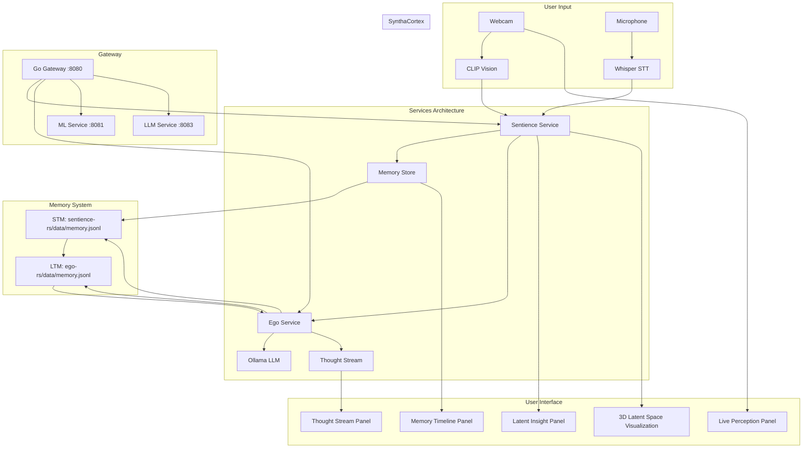

# 4_SYSTEM_ARCHITECTURE

## High-level Diagram **IMPLEMENTED**



## **IMPLEMENTED MODULES**

### 1 **ML Service** (`services/ml-py`) - **COMPLETE**

- **Vision:** Real-time CLIP processing → top‑k labels + embeddings + color/affect detection
- **Performance:** <100ms processing time
- **Features:** Real-time camera capture, CLIP integration, affect detection

### 2 **Sentience Service** (`services/sentience-rs`) - **COMPLETE**

- **Multi-modal Processing:** Vision + Speech tokenization
- **Semantic Facets:** `vision.object`, `speech.intent`, `affect.valence`, `affect.arousal`
- **Memory Integration:** Automatic memory event creation
- **Performance:** <200ms speech processing

### 3 **Ego Service** (`services/ego-rs`) - **COMPLETE**

- **AI Reflection:** Real-time thought generation with Ollama integration
- **Memory Consolidation:** AI suggests and consolidates memories into concepts
- **Consciousness Metrics:** Attention, salience, coherence tracking
- **LTM Persistence:** Separate LTM file for consolidated memories

### 4 **Memory System** - **COMPLETE**

- **STM:** `services/sentience-rs/data/memory.jsonl` (unconsolidated)
- **LTM:** `services/ego-rs/data/memory.jsonl` (consolidated concepts)
- **Features:** Memory consolidation, concept creation, temporal navigation

### 5 **UI System** (`ui/`) - **COMPLETE**

- **Panel A – Live Perception:** Camera feed, CLIP labels, audio visualization
- **Panel B – Latent Insight:** Semantic facets, progress bars, nearest neighbors
- **Panel C – Thought Stream:** AI reflections, consciousness metrics, auto/manual modes
- **Panel D – Memory Timeline:** Event filtering, waypoint system, A/B comparison
- **3D Visualization:** Interactive latent space exploration with multiple view modes

### 6 **Gateway Service** (`cmd/gateway`) - **COMPLETE**

- **API Routes:** HTTP + SSE event streaming
- **Service Orchestration:** Health checks, service discovery
- **Performance:** Optimized with request size limits and CORS

## Data Contracts (Events)

```ts
// perception
type VisionObservation = {
  type: "vision.observation";
  ts: number;
  image_id: string;
  clip_topk: Array<{label: string; score: number}>;
  embedding: number[]; // optional truncated
};

type SpeechTranscript = {
  type: "speech.transcript";
  ts: number;
  text: string;
  confidence?: number;
};

// sentience
type SentienceToken = {
  type: "sentience.token";
  ts: number;
  facets: Record<string, string | number>; // e.g., { "vision.object": "cat", "affect.valence": +0.3 }
};

// thoughts
type Thought = {
  type: "ego.thought";
  ts: number;
  text: string;
  evidence?: string[]; // ids of events that informed the thought
  metrics?: {
    self_awareness: number;
    memory_consolidation_need: number;
    emotional_stability: number;
    creative_insight: number;
  };
};
```
