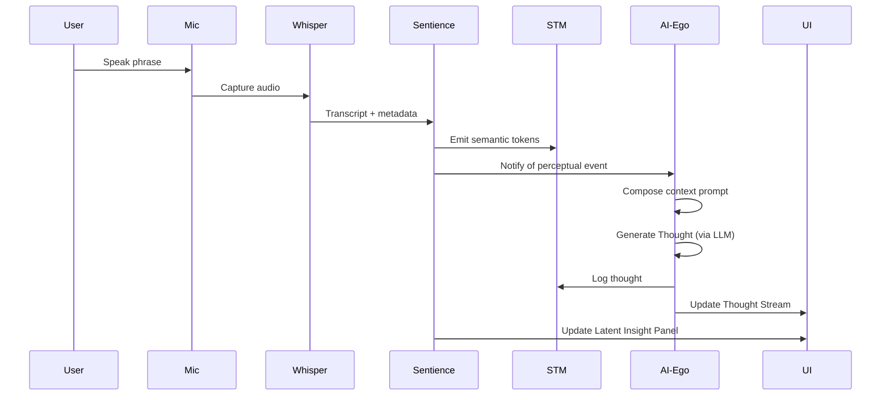

# 5_INTERFACE_AND_FLOW

## Overview

This document describes the interactive flow between the user and the latent-journey system, with a focus on user inputs, perceptual updates, agent reflections, and real-time feedback.

It includes UI design rationale, interaction patterns, and a step-by-step breakdown of how a single user action (e.g. speaking or showing an image) flows through the architecture.

---

## User Interface Layout (Logical Zones)

The UI is divided into 4 primary panels:

- **Panel A – Live Perception:** shows the camera stream, CLIP output (top-k labels), and live speech transcription.
- **Panel B – Latent Insight:** displays top semantic tokens, CLIP/GPT nearest neighbors, and latent similarity.
- **Panel C – Thought Stream:** running log of AI-Ego reflections.
- **Panel D – Memory Timeline:** chronological record of past events and system thoughts with tagging (e.g. reward, uncertainty).

---

## Interaction Flow (Example: User Speaks)

---

## Supported Input Modalities

- **Visual:** Webcam (default), file upload (image)
- **Audio:** Push-to-talk microphone
- **Text:** Manual prompt entry (LLM direct input)

---

## Dynamic Feedback and Reactions

- All perceptual input triggers semantic tokenization.
- Semantic tokens trigger AI-Ego reflections if novel or salient.
- Reflections are shown immediately in the Thought Stream.
- Visual and semantic cues update across the UI.

---

## Planned Extensions

- Multi-agent reflection (simulated internal dialogue)
- Parallel perceptual channels (e.g. multiple image inputs)
- Emotion/mood drift based on interaction history
- Embedding trajectory maps (latent path visualization)
